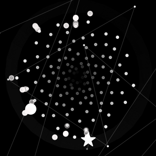
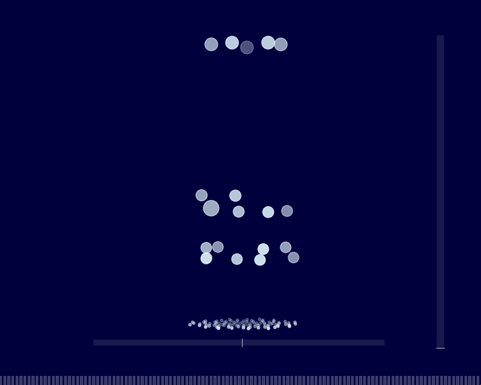
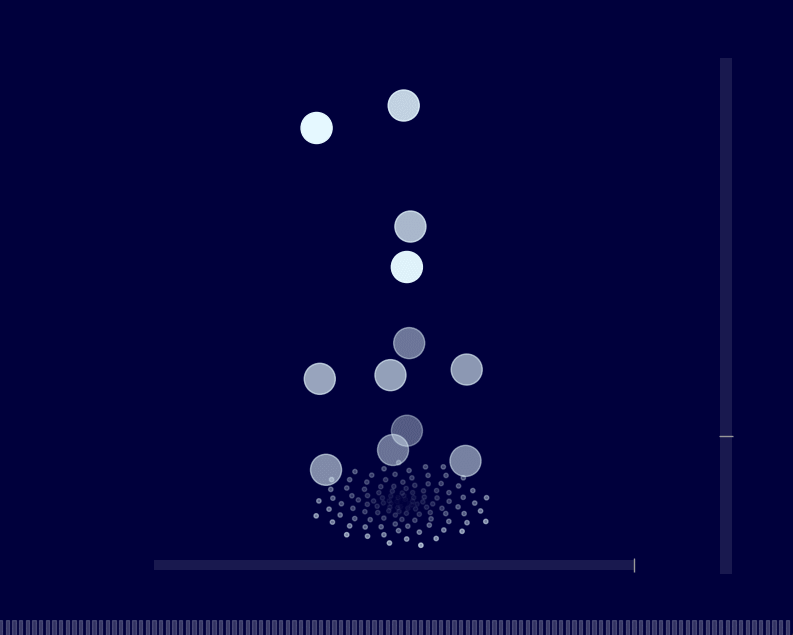
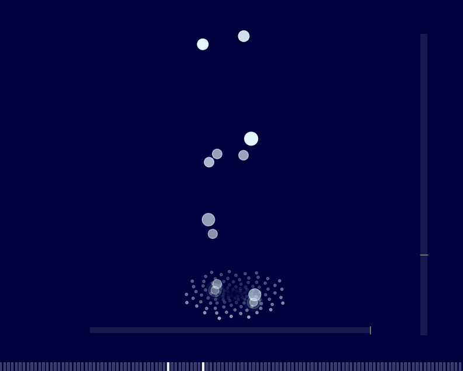

<p align="center">
  
</p>

# Musical Bubble Column! 
[让我们说中文](README_ch.md)

**Musical Bubble Column** is a 3D music visualization project built with Python that displays MIDI music in a visual format. Using **Matplotlib** and **Pygame**, it creates a visual representation of musical notes arranged in a Fibonacci spiral pattern.

## Features

<p align="center">
  
</p>

### Piano Visualization
- Piano key visualization (The virtual piano keys in the visualization do not strictly match the actual piano keys.)
- Note display
- MIDI playback

### 3D Visualization
- 3D bubble animations
- Fibonacci-sequence based layout
- Adjustable viewing angles (Elevation & Azimuth)
- Basic physics simulation

### MIDI Processing
- MIDI file support
- Piano sound mapping
- Volume-based visual effects

## Getting Started

### Prerequisites
Python 3.7+ and the following packages are required:
```bash
pip install matplotlib mido pygame numpy scipy PyQt5 numba
```

### Running the Application
1. Clone this repository
2. Navigate to the project directory
3. Run the main application:
   ```bash
   python musicalbubblecolumn.py
   ```
4. Select your MIDI file to start

Alternatively, you can download the precompiled .exe file from the [releases](https://github.com/NowLoadY/MusicalBubbleColumn/releases) section and run it directly without needing to set up the Python environment.

## Features in Detail

### Visualization
- Bubble generation based on notes
- Floating animations
- Volume-based visual effects

### Controls

<p align="center">
<table align="center">
<tr>
  <td></td>
  <td></td>
  <td></td>
</tr>
<tr align="center">
  <td>View adj: elev</td>
  <td>View adj: azim</td>
  <td>Zoom in/out</td>
</tr>
</table>
</p>

- View angle adjustment: slider
- Change theme: double click

## Technical Details

### Components
- **PatternVisualizer3D**: Visualization engine
- **MIDI Processor**: MIDI data handling
- **Physics Sim**: Bubble movement

### Optimizations
- Numba acceleration
- Memory management

## Notes
- Optimized for standard MIDI files
- Performance depends on system hardware

## Contributing
We welcome:
- Bug reports
- Feature suggestions
- Pull requests

## Collaboration

If you're interested in collaborating on this project or have any ideas for improvement, feel free to reach out! I'm open to discussions and welcome any contributions that could enhance this visualization tool.

You can:
- Open an issue for discussion
- Submit a pull request
- Contact me for any questions or suggestions

## License
This project is licensed under the GNU General Public License v3.0 (GPL-3.0) - see the LICENSE file for details.
