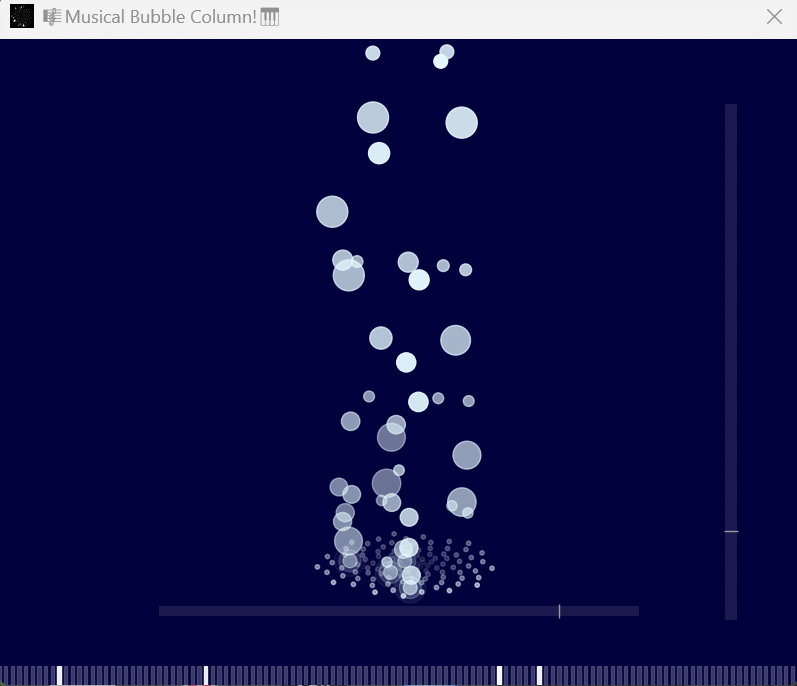

# Musical Bubble Column 

<p align="center">
  
</p>

**Musical Bubble Column** is a 3D music visualization project built with Python that displays MIDI music in a visual format. Using **Matplotlib** and **Pygame**, it creates a visual representation of musical notes arranged in a Fibonacci spiral pattern.

## Features

### Piano Visualization
- Piano key visualization
- Note display
- MIDI playback

### 3D Visualization
- 3D bubble animations
- Fibonacci-sequence based layout
- Adjustable viewing angles (Elevation & Azimuth)
- Basic physics simulation

### MIDI Processing
- MIDI file support
- Piano sound mapping
- Volume-based visual effects

## Getting Started

### Prerequisites
Python 3.7+ and the following packages are required:
```bash
pip install matplotlib mido pygame numpy scipy PyQt5 numba
```

### Running the Application
1. Clone this repository
2. Navigate to the project directory
3. Run the main application:
   ```bash
   python musicalbubblecolumn.py
   ```
4. Select your MIDI file to start

## Features in Detail

### Visualization
- Bubble generation based on notes
- Floating animations
- Volume-based visual effects

### Controls
- View angle adjustment
- Perspective control
- Visualization settings

## Technical Details

### Components
- **PatternVisualizer3D**: Visualization engine
- **MIDI Processor**: MIDI data handling
- **Physics Sim**: Bubble movement

### Optimizations
- Numba acceleration
- Memory management

## Notes
- Optimized for standard MIDI files
- Performance depends on system hardware

## Contributing
We welcome:
- Bug reports
- Feature suggestions
- Pull requests

## License
This project is licensed under the MIT License - see the LICENSE file for details.
