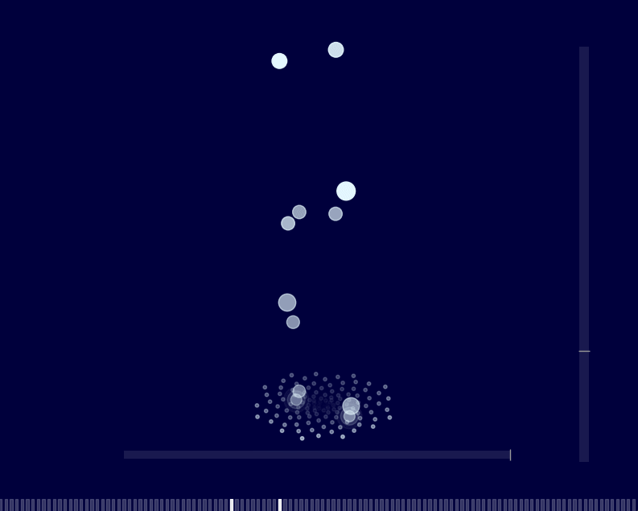

# Musical Bubble Column！

**Musical Bubble Column** 是一个基于 Python 的 3D 音乐可视化项目，使用 MIDI 音乐文件生成可视化效果。通过 **Matplotlib** 和 **Pygame**，它将音符以 Fibonacci 螺旋图案的形式呈现出来。

## 特性

<p align="center">    </p>

### 钢琴可视化

- 钢琴键可视化（可视化中的虚拟钢琴键并不严格匹配实际钢琴键）
- 音符显示
- MIDI 播放

### 3D 可视化

- 3D 气泡动画
- 基于 Fibonacci 数列的布局
- 可调节的视角（高度与方位角）
- 基本物理模拟

### MIDI 处理

- 支持 MIDI 文件
- 钢琴音符映射
- 基于音量的视觉效果

## 食用说明

### 前提条件

需要 Python 3.7+ 和以下包：（测试3.11）

```bash
pip install matplotlib mido pygame numpy PyQt5 numba
```

在 Linux 系统下，你需要安装 fluidsynth:
```bash
sudo apt-get install fluidsynth
```

### 运行应用程序

1. 克隆此仓库

2. 进入项目目录

3. 运行主程序：

   ```bash
   python musicalbubblecolumn.py
   ```

4. 选择 MIDI 文件开始播放

直接从 [发布页面](https://github.com/NowLoadY/MusicalBubbleColumn/releases) 下载预编译的 .exe 文件，直接运行就OK

## 特性详细说明

### 可视化

- 根据音符生成气泡
- 漂浮动画
- 基于音量的视觉效果

### 控制

<p align="center">
<table align="center">
<tr>
  <td></td>
  <td></td>
  <td></td>
</tr>
<tr align="center">
  <td>调整俯仰角</td>
  <td>调整视角方向</td>
  <td>放大/缩小</td>
</tr>
</table>
</p>

- 视角调整：滑动条
- 换主题：双击

## 技术细节

### 组件

- **PatternVisualizer3D**: 可视化引擎
- **MIDI Processor**: MIDI 数据处理
- **Physics Sim**: 气泡运动模拟

### 优化

- Numba 加速
- 内存管理

## 注意事项

- 优化支持标准 MIDI 文件
- 性能依赖于系统硬件

## 合作交流

什么？真的有人提出修改吗！？如果你对这个项目感兴趣或者有什么新奇的想法，随时欢迎来DD！

你可以：
- 开个issue来唠嗑
- 提PR秀骚操作
- 直接联系我交流都可以

## 许可

本项目遵循 GNU 通用公共许可证 v3.0（GPL-3.0）- 详细内容请参阅 LICENSE 文件。

## AI 项目
时代变了大人，这是大量利用AI辅助编程产出的项目，将继续加大AI编程的力度。
